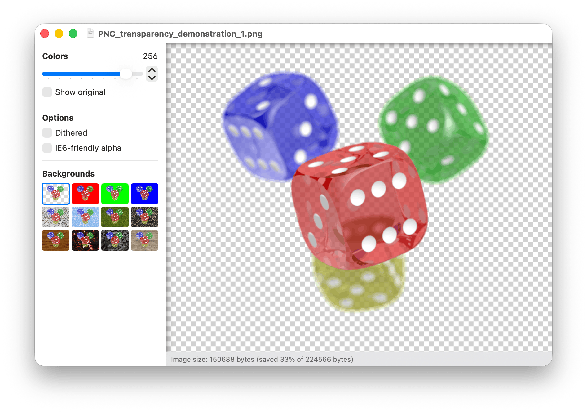

<div align="center">

# ImageAlpha

**Lossy PNG compression for macOS** — reduce file sizes by applying lossy compression to the alpha channel.

[](https://github.com/bensquire/ImageAlpha/releases)
[](https://swift.org)
[](https://www.gnu.org/licenses/gpl-3.0.html)
[](https://github.com/bensquire/ImageAlpha/actions/workflows/ci.yml)
[](https://github.com/bensquire/ImageAlpha/releases)

<br>



</div>

<br>

## Features

- **Lossy alpha compression** powered by pngquant/libimagequant
- **Real-time preview** — see before/after as you adjust settings
- **Adjustable colors and dithering** for fine-tuned control
- **Background previews** — checkerboard, solid color, and image textures
- **File size savings** displayed before saving

## Download

Pre-built binaries are available on the [**Releases**](https://github.com/bensquire/ImageAlpha/releases) page.

## Build from source

### Prerequisites

- Xcode 16+
- Rust toolchain (`cargo`) — install via [rustup.rs](https://rustup.rs/)

### Clone and build

```sh
git clone --recursive https://github.com/bensquire/ImageAlpha.git
cd ImageAlpha
make pngquant   # build libimagequant (Rust)
make release     # build the app (Xcode)
```

The built app will be at `~/Library/Developer/Xcode/DerivedData/ImageAlpha-*/Build/Products/Release/ImageAlpha.app`.

To create a distributable zip:

```sh
make zip
```

## Credits

- [Kornel Lesiński](https://kornel.ski/) — original ImageAlpha author
- [pngquant](https://pngquant.org/) and [libimagequant](https://github.com/ImageOptim/libimagequant) — the quantization engine
- [ManyTextures](https://manytextures.com/) — tileable background images

## License

This project is licensed under the [GNU General Public License v3.0](https://www.gnu.org/licenses/gpl-3.0.html).
