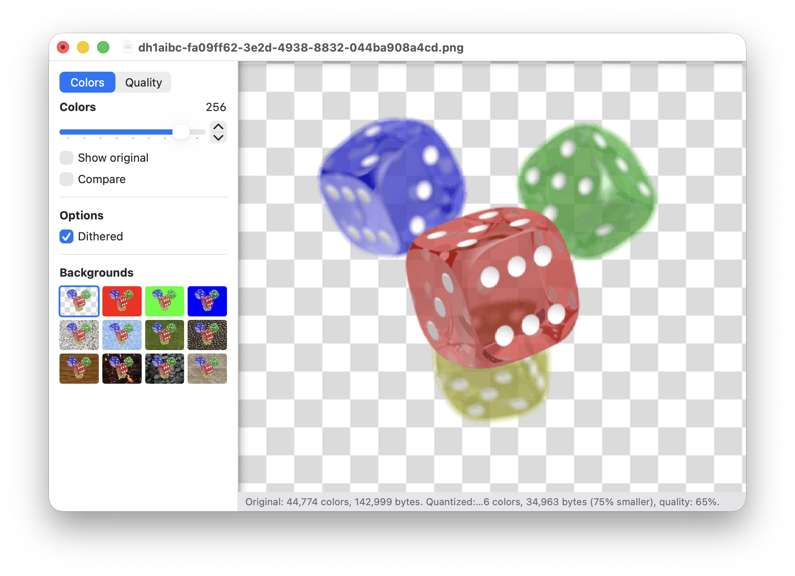

<div align="center">

# ImageAlpha

**Lossy PNG compression for macOS** — reduce file sizes by applying lossy compression to the alpha channel.

[](https://github.com/bensquire/ImageAlpha/releases)
[](https://swift.org)
[](https://www.gnu.org/licenses/gpl-3.0.html)
[](https://github.com/bensquire/ImageAlpha/actions/workflows/ci.yml)
[](https://github.com/bensquire/ImageAlpha/releases)
[](https://buymeacoffee.com/squired)

<br>



</div>

<br>

## Features

- **Lossy alpha compression** powered by pngquant/libimagequant
- **Real-time preview** — see before/after as you adjust settings
- **Adjustable colors and dithering** for fine-tuned control
- **Quality mode** — pick a quality target instead of a color count, and the smallest palette that reaches it is chosen automatically
- **Quality readout** — the status bar shows libimagequant's measured quality for every result
- **Side-by-side comparison** — split view with draggable divider to compare original and quantized
- **Copy & drag export** — Cmd+C to copy, or drag the image directly to Finder or other apps
- **Background previews** — checkerboard, solid color, and image textures
- **File size savings** displayed before saving
- **Open With support** — right-click any PNG in Finder to open in ImageAlpha

## Colors mode vs. Quality mode

The sidebar offers two ways to control quantization:

- **Colors** — fix the palette size (2–256 colors, or 24-bit passthrough).
- **Quality** — set a quality target (0–100%); the fewest colors that reach it are used.

The status bar shows the *measured* quality of each result. In Quality mode this usually lands above your target, because the smallest palette that clears it is kept; if even 256 colors fall short, it shows the shortfall instead of refusing to convert. A measured quality well above your target means you can lower the target for a smaller file.

## Download

Pre-built binaries are available on the [**Releases**](https://github.com/bensquire/ImageAlpha/releases) page.

## Build from source

### Prerequisites

- Xcode 16+
- Rust toolchain (`cargo`) — install via [rustup.rs](https://rustup.rs/)

### Clone and build

```sh
git clone --recursive https://github.com/bensquire/ImageAlpha.git
cd ImageAlpha
make pngquant   # build libimagequant (Rust)
make release     # build the app (Xcode)
```

The built app will be at `~/Library/Developer/Xcode/DerivedData/ImageAlpha-*/Build/Products/Release/ImageAlpha.app`.

To create a distributable DMG:

```sh
brew install create-dmg
make dmg
```

## Credits

- [Kornel Lesiński](https://kornel.ski/) — original ImageAlpha author
- [pngquant](https://pngquant.org/) and [libimagequant](https://github.com/ImageOptim/libimagequant) — the quantization engine
- [ManyTextures](https://manytextures.com/) — tileable background images

## License

This project is licensed under the [GNU General Public License v3.0](https://www.gnu.org/licenses/gpl-3.0.html).
